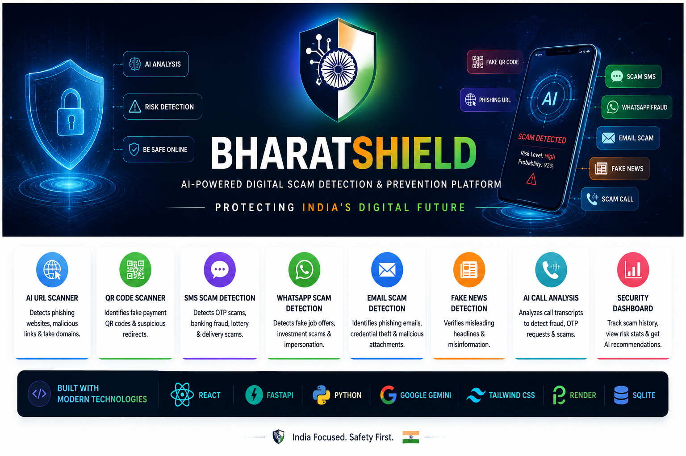

# BharatSHIELD



Protecting India's Digital Future.

BharatSHIELD is a digital scam safety platform for checking suspicious messages, URLs, QR codes, emails, job offers, investment claims, news forwards, and call transcripts.

## Features

- Scam risk score with reason breakdown
- SMS, WhatsApp, email, job, investment, news, call, URL, and QR scan modes
- Suspicious keyword highlighting
- URL checks for HTTPS, risky TLDs, brand lookalikes, digits, hyphens, and deep subdomains
- QR review for UPI ID, merchant, amount, notes, and hidden redirects
- Signup and login flow with local SQLite storage
- Safety dashboard with trends, report export, and India attack map

## Tech Stack

- React + Vite
- FastAPI + Python
- SQLite
- Optional Gemini API support

## Run Frontend

```powershell
npm install
npm run dev
```

Open `http://127.0.0.1:5173`.

## Run Backend

```powershell
cd backend
python -m venv .venv
.venv\Scripts\Activate.ps1
pip install -r requirements.txt
uvicorn main:app --reload --host 127.0.0.1 --port 8000
```

Optional Gemini support:

```powershell
$env:GEMINI_API_KEY="your_key_here"
uvicorn main:app --reload --host 127.0.0.1 --port 8000
```

Without `GEMINI_API_KEY`, the app runs with the built-in rule engine.
